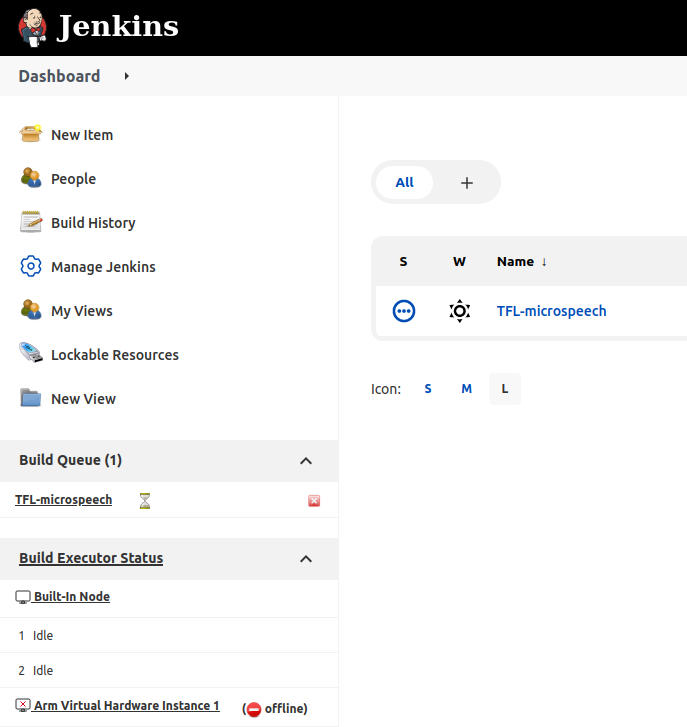
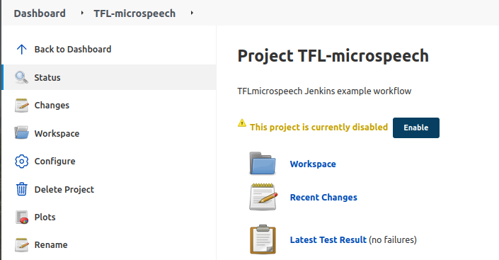
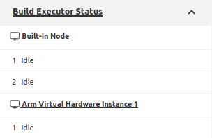
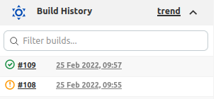
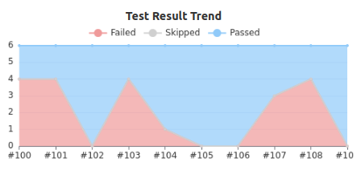
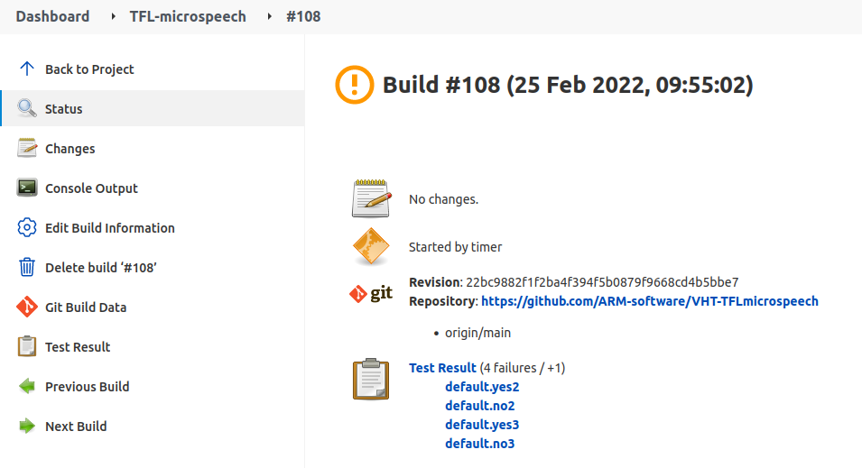
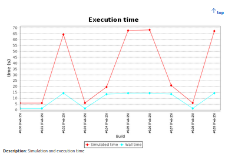
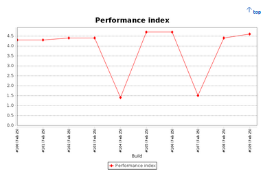
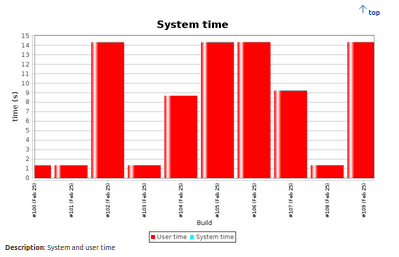

# Arm Virtual Hardware Jenkins Tutorial

This tutorial is an example of a Jenkins server running an ML application [TFL-microspeech](https://github.com/ARM-software/VHT-TFLmicrospeech) on Arm Virtual Hardware agent in the cloud.

## Start an instance

Follow the steps from this tutorial to [launch](https://github.com/ARM-software/Tool-Solutions/tree/master/mlops-cloud#amilaunch) and connect to the [Arm Virtual Hardware AMI](https://github.com/ARM-software/Tool-Solutions/tree/master/mlops-cloud#console).

When connected to the Arm Virtual Hardware instance with SSH, type the following commands to configure the instance for the Jenkins agent (ffpmeg is only needed in our tutorial to generate different input data sets):

```
$ sudo apt update
$ sudo apt install fontconfig openjdk-11-jre ffmpeg
$ ssh-keygen -f ~/.ssh/jenkins_agent_key
$ cat ~/.ssh/jenkins_agent_key.pub >> ~/.ssh/authorized_keys
```

Copy the content of ~/.ssh/jenkins_agent_key for later.

## Start Jenkins with Docker

You can run Jenkins locally in a [Docker container](https://github.com/jenkinsci/docker/blob/master/README.md). In the rest of this tutorial, we are going to configure the Arm Virtual Hardware instance as an [agent](https://www.jenkins.io/doc/book/using/using-agents/).

On your local machine, clone this repository, pull the Docker Jenkins image and start an instance:

```
$ git clone https://github.com/armflorentlebeau/mlops-jenkins.git
$ docker pull jenkins/jenkins
$ docker run -p 8080:8080 -p 50000:50000 -v $PWD/jenkins_home:/var/jenkins_home jenkins/jenkins
```

## Configure Jenkins

Locally, open the Jenkins' web interface that was started with Docker: [http://localhost:8080](http://localhost:8080)

Follow the steps in the web interface to configure Jenkins with the suggested plugins. Note that the default password for the admin is displayed in the terminal running the docker instance.

Set up the user admin with a password of your choice and go on with the default settings. When logged in, you should see the "TFL-microspeech" job in the Dashboard. You can already find a build history and a test result trend plot. The "Arm Virtual Hardware Instance 1" in the list of build executors. "Arm Virtual Hardware Instance 1" appears offline for now.



## Add Jenkins plugin to plot data

Go to *Manage Jenkins* => *Jenkins CLI* and download *jenkins-cli.jar* (e.g. to ~/Downloads).

In a different terminal window, type the following commands to install the plugin and restart jenkins. You will need to have java installed locally:

```
$ java -jar ~/Downloads/jenkins-cli.jar -auth admin:avh -s http://localhost:8080/ -webSocket install-plugin Plot -deploy
$ java -jar ~/Downloads/jenkins-cli.jar -auth admin:avh -s http://localhost:8080/ -webSocket restart
```

From the web browser, refresh and log in as admin again: [http://localhost:8080](http://localhost:8080)

You can now view the *Plots* section for the TFL-microspeech job.



## Configure Jenkins node

From the list of build executors in the Dashboard, select *Arm Virtual Hardware Instance 1* => *Configure*:

- Specify the host IP of the instance that has been launched earlier
- In *Credentials*, click on *Add* =>*Jenkins*
- - Specify *SSH username with private key*
- - Specify _ubuntu_ in *username*
- - In *Private key: Enter directly*, add and copy the jenkins\_agent\_key private key created on the AVH instance earlier, specify the passphrase if needed
- - Add key and select *ubuntu* from the drop-down menu
- Save configuration
- Click on *Launch agent* and *Trust SSH Host Key* to make the connection for the first time. When connected, the node appears *idle* i.e. ready to run a job.



## Start a build or enable TFL-microspeech job

The TFL-microspeech job is disabled by default. When enabled, *Build Now* in the job settings will start building and testing. *Configure* shows what repository is checked out, how the application is built and tested using [shell2junit](https://github.com/manolo/shell2junit) to display results in Jenkins. Here, the job can also be configured to run periodically.

The job runs intermitently the TFL-microspeech application simulation using a reference audio input file or a truncated version. It also intermitently runs in different configurations which affects the simulation time and performance. When the application terminates, its output is compared against the reference. As a result, builds might intermitently see all tests pass but some might fail.

## Processing the results

The TFL-microspeech build history reports when a build succeeded and all tests passed (green tick), when it has failed to complete (red cross), or when it is unstable because some tests didn't pass (orange exclamation mark).



The *Test Result Trend* give more details about the amount of tests that passed (in blue) or failed (in red), depending on the build number.



For a specific build ID, users can get more details about which tests failed. In the example below, the job checks if the software detects the right sequence of 6 yes/no keyword at the right time on the reference audio input file: we can see that it has correctly detected the 2 first keywords but not the others.



The job contains a *Plot* section that aggregates data over runs and provides insight about:

- Simulation time vs. execution time:



- Performance



- System time vs. user time




